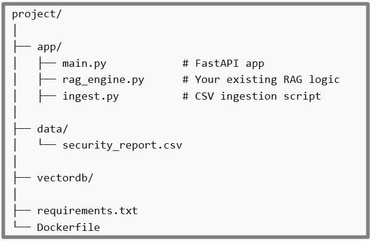

<h3>  
<b ">This is a simple RAG app</b>  </h3>

This RAG app aims use any CSV files (Vulnerrability Report)  as input and binds the files in to a single file. Then allows the end user to query anything from the Vulnerrability Report. There 3 components in this RAG + CSV + Ollama.

<h3> <b>    Architecture - Ollama(Local) + Hosting the App     </b></h3>

User (Browser)    
   &nbsp; &nbsp; &nbsp; &nbsp; &nbsp; &nbsp;↓  
Frontend (React / Streamlit)  
   &nbsp; &nbsp; &nbsp; &nbsp;&nbsp; &nbsp; ↓  
Backend API (FastAPI / Flask)  
   &nbsp; &nbsp; &nbsp; &nbsp;&nbsp; &nbsp; ↓  
RAG Pipeline  
 &nbsp; &nbsp;  &nbsp; &nbsp; &nbsp; &nbsp; ↓  
CSV (stored as embeddings in vector DB)  
 &nbsp; &nbsp; &nbsp; &nbsp;  &nbsp; &nbsp; ↓  
Ollama running on your machine/server  

<h3> <b>   Creating the Backend API    </b></h3>

<h3> <b>        </b></h3>

    

<h3> <b>        </b></h3>

    

<h3> <b>        </b></h3>

    

<h3> <b>        </b></h3>

    

<h3> <b>        </b></h3>

    

<h3> <b>        </b></h3>

    

<h3> <b>        </b></h3>

    

